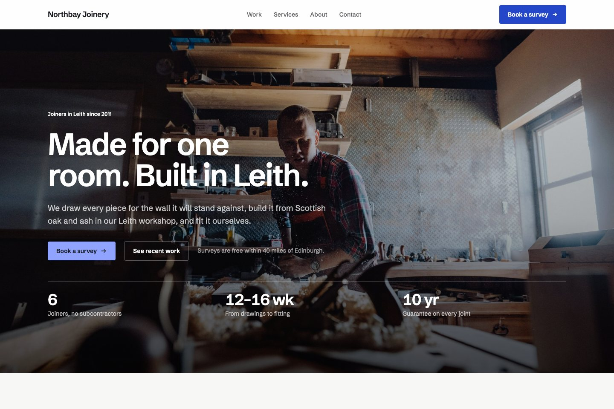
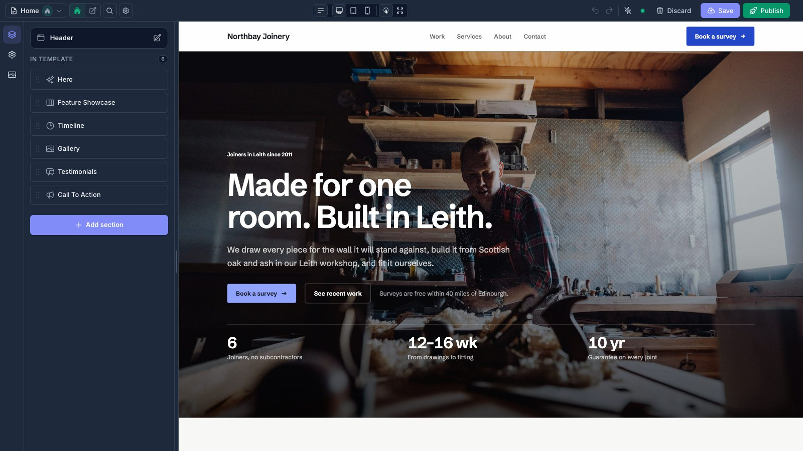

# FilamentCraft site starter

A Laravel app with a finished company website that you edit in the browser.



The website belongs to Northbay Joinery, a workshop in Leith that does not exist. It gives you
something real to take apart: five pages, a header and footer, a contact form that lands in an
inbox, and 21 photographs already in the media library. Change the words and pictures and it
is your site.

Built on Laravel 13, Filament 5 and [FilamentCraft](https://filamentcraft.dev).

## Before you start

- PHP 8.3 or newer and Composer 2. No Node, no build step.
- A FilamentCraft license. The package is installed from a private Composer registry, and
  setup asks for the email you bought it with and your license key.
  [Get a license](https://filamentcraft.dev/pricing).

## Install

```bash
git clone https://github.com/filamentcraft/starter-site my-site
cd my-site
composer setup
```

`composer setup` checks your license against `packages.filamentcraft.dev`, installs the
dependencies, creates a SQLite database, builds the website and prints where to sign in. It is
safe to run again.

Then start the server:

```bash
composer dev
```

Open http://localhost:8000 for the website and http://localhost:8000/admin for the panel.
Sign in as `admin@example.com` with the password `password`, and change both.

With [Laravel Herd](https://herd.laravel.com), skip `composer dev`: run `herd link` in the
project and set `APP_URL=http://my-site.test` in `.env`.

<details>
<summary>Installing without a prompt (CI, Docker, servers)</summary>

Setup reads the credentials from any of these, in order, and never asks:

1. `COMPOSER_AUTH` with an `http-basic` entry for `packages.filamentcraft.dev`
2. an `auth.json` next to `composer.json`
3. your global Composer credentials
   (`composer config --global http-basic.packages.filamentcraft.dev you@example.com KEY`)
4. `FILAMENTCRAFT_EMAIL` and `FILAMENTCRAFT_KEY`

</details>

## Editing the website



In the panel, **Website builder** opens the editor on the homepage. Click a section to change
it, drag to reorder, **Add section** for something new. **Save** keeps a draft, **Publish**
puts it live. The dashboard lists every page with a shortcut into the editor.

Messages sent from the contact page arrive under **Inbox**. To also get them by email, set
`FILAMENTCRAFT_FORMS_NOTIFY=you@example.com` and configure `MAIL_*` in `.env`.

## Where things live

| Path | What it is |
|---|---|
| `app/Blueprints/NorthbaySite.php` | The site: header, footer, color schemes, fonts, SEO defaults |
| `app/Blueprints/Pages/` | One class per page, listing its sections and their content |
| `app/Support/SiteImages.php` | The seeded photographs and their alt text |
| `resources/images/` | The photographs themselves |
| `app/Filament/Widgets/WebsitePages.php` | The page list on the dashboard |
| `config/filamentcraft.php` | Package settings. `public_routes` is on, so FilamentCraft serves `/` |
| `bin/license` | The license check that runs before `composer install` |

The blueprint classes only matter the first time the database is seeded. After that the
website lives in the database and is edited in the panel.

## Making it yours

You can do everything in the editor. If you would rather start from your own content in code,
edit the blueprint classes and rebuild:

```bash
php artisan migrate:fresh --seed
```

That wipes the database, including anything changed in the editor.

A few things worth changing first:

- **Name and colors.** `NorthbaySite::siteSettings()` holds the three color schemes (light,
  blue, dark) and the font. In the editor they are under the gear icon in the left rail.
- **Photographs.** Drop files into `resources/images`, add them to `SiteImages::ALT`, and use
  them with `$this->image('file-name')`.
- **Pages.** Add a class to `app/Blueprints/Pages` and list it in `NorthbaySite::pages()`.
  Any of FilamentCraft's 38 sections can go in it.

## Going live

- Set `APP_URL` to the real domain. Links, the sitemap and social cards are built from it.
- Give the server your registry credentials through `COMPOSER_AUTH`, or on Laravel Forge under
  **Site → Settings → Composer**.
- Add `php artisan filamentcraft:upgrade` to your deploy script after `migrate`. Composer
  updates do not publish new FilamentCraft migrations or assets on their own.
- With Redis available, set `FILAMENTCRAFT_CACHE_ENABLED=true` and
  `FILAMENTCRAFT_CACHE_STORE=redis` to cache rendered sections.
- `php artisan filamentcraft:doctor` checks the install and tells you how to fix what it finds.

## Tests

```bash
composer test
```

Runs Pint, PHPStan at level 6 and the Pest suite. The GitHub workflow does the same; add
`FILAMENTCRAFT_EMAIL` and `FILAMENTCRAFT_KEY` as repository secrets so it can install the
package.

## The other starter kits

- [starter-store](https://github.com/filamentcraft/starter-store): one shop, with a catalog,
  cart, checkout and orders.
- [starter-multistore](https://github.com/filamentcraft/starter-multistore): a platform where
  every merchant gets their own store.

## License

The code in this repository is MIT licensed. FilamentCraft itself is commercial software.
Photographs are from Unsplash; see [CREDITS.md](CREDITS.md).
